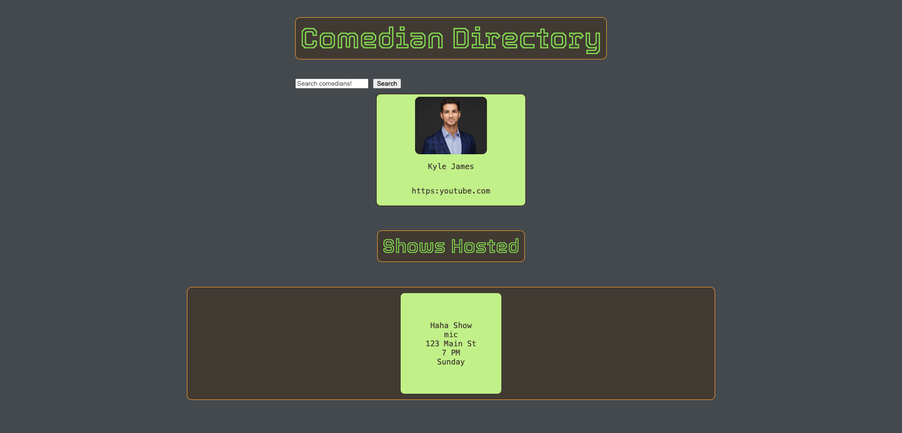

# Comedy Shows Database

This is a database of local comedy shows, open mics, comedians, and venues. 

## Shows and Open Mics

The comedy shows and open mics will display the address, the host, the start time, and the frequency. Events will be organized by day of week. This will be the landing page. It will allow the user to create a new event, or update an event, or delete an event.

## Comedians

The comedians model will list the comedians, and display their names and headshots. It will be searchable. It will also display a list of shows they host.

## Venues

The venues model will list the venues, along with their address and seating capacity. It will also display a list of the shows that are hosted there.

## Relationships

Shows will have a many to many relationship with comedians. Each show will have one or more comedian hosts, and each comedian can host zero, one, or many shows.

Shows will have a many to one relationship with venues. Each is run at one venue, but each venue can run one or many shows.

## User Stories (As A User I Want To) and Minimum Viable Product (MVP)

1. AAUIWT view all comedy shows and related data.
4. AAUIWT view all comedians and related data.
5. AAUIWT view all venues and related data.
6. AAUIWT use backend ThunderClient to create, update, or delete mics, shows, comedians, and venues.
2. AAUIWT filter by day of week.
8. AAUIWT click on an event and see an expanded section with extra details.
9. AAUIWT link to a venue or comic from the event.

## Stretch Goals

1. AAUIWT use frontend HTML to create, update, or delete mics, shows, comedians, and venues.
7. AAUIWT add headshot links or video links to a comedian profile.
3. AAUIWT filter by open mic or show.
1. AAUIWT have the show frequency calculate and display the date of the next occurence of the show. 

## ERD 

## Mockups 

### Technologies Used
referenced ChatGPT for the following:
* front end CRUD functionality
* form input 
* input dropdowns
